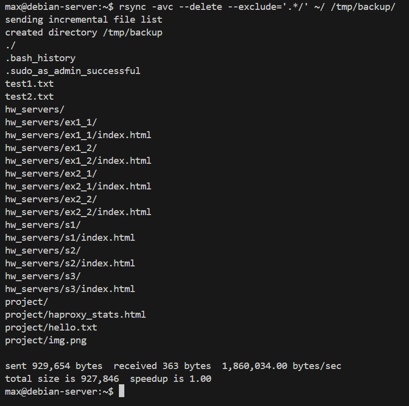
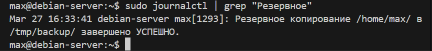

# Домашнее задание к занятию 3 «Резервное копирование» - Моськов Максим

### Задание 1.

rsync -avc --delete --exclude='.*/' ~/ /tmp/backup/

### Задание 2.

'''#!/bin/bash

SOURCE="$HOME/"
DEST="/tmp/backup/"

mkdir -p "$DEST"

if rsync -ac --delete --exclude='.*/' "$SOURCE" "$DEST"; then
    logger "Резервное копирование $SOURCE в $DEST завершено УСПЕШНО."
else
    logger "ОШИБКА резервного копирования $SOURCE в $DEST."
fi'''

